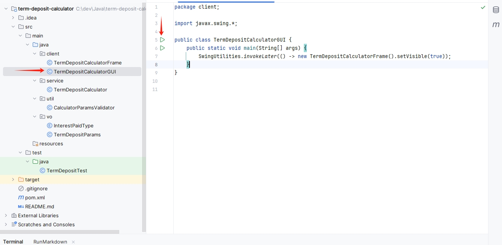
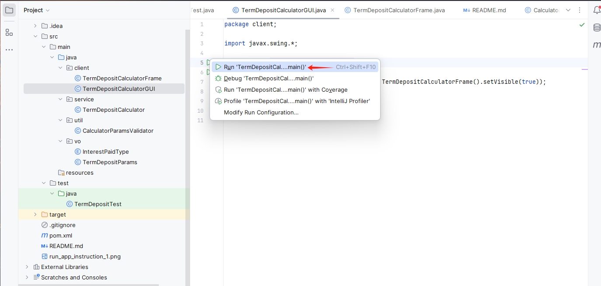
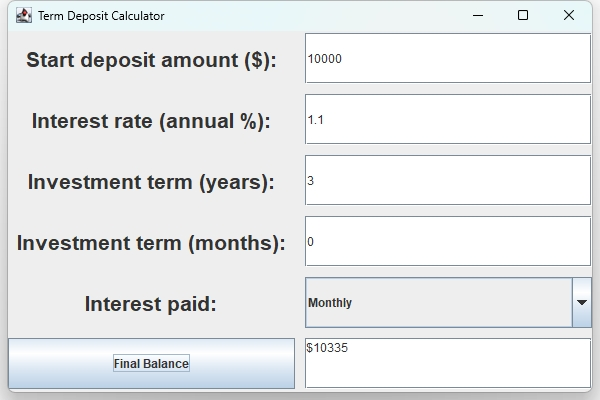
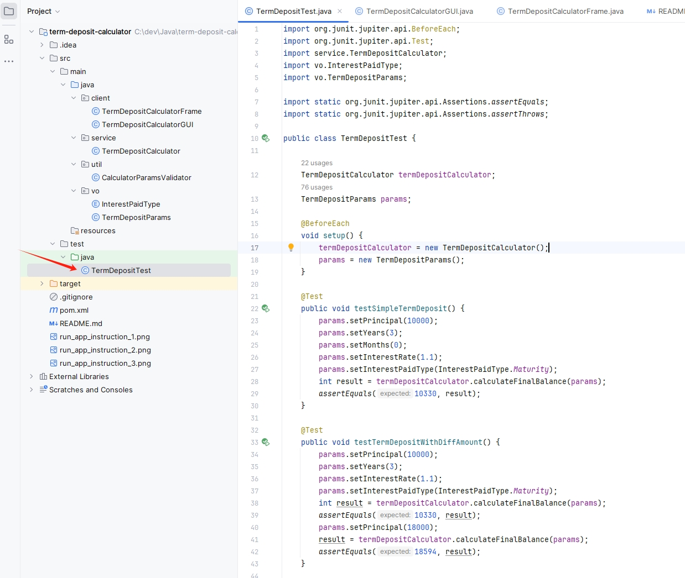
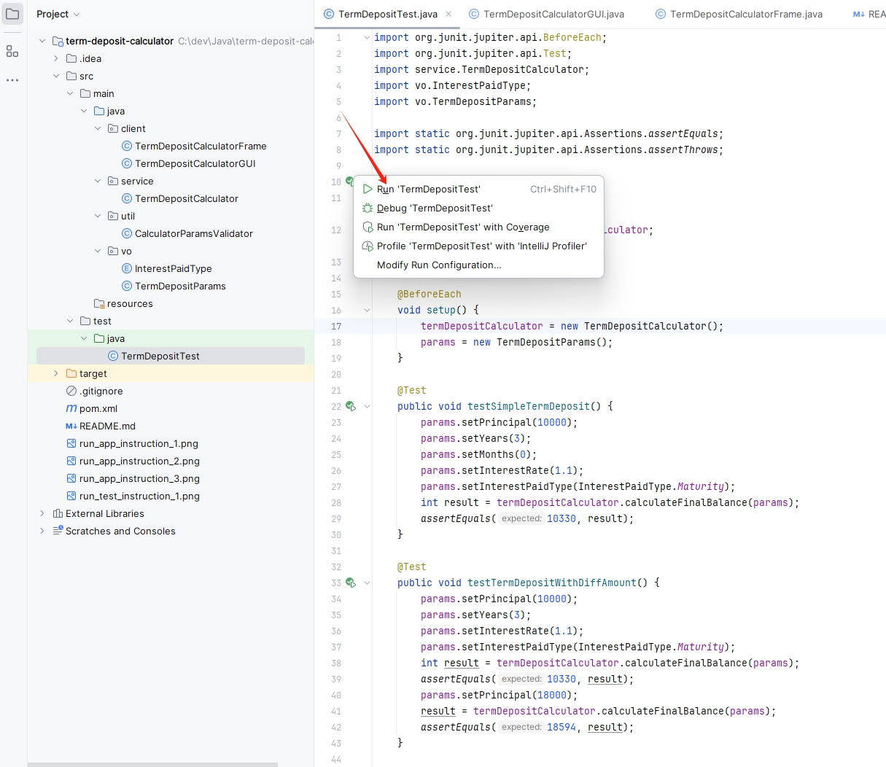

# Term Deposit Calculator

## Overview
This project is a Java-based **Term Deposit Calculator** that helps users calculate the final balance of a term deposit based on user inputs like principal, interest rate, term duration, and interest payout frequency. 
The application provides a graphical user interface (GUI) for user interaction and incorporates proper validation for input parameters.

The functional design of this calculator is based on [this calculator](https://www.bendigobank.com.au/calculators/deposit-and-savings/).

## Table of Contents
- [Overview](#overview)
- [Project Structure](#project-structure)
- [Features](#features)
- [Prerequisites](#prerequisites)
- [Run application](#Run-application)
- [Usage](#usage)
- [Testing](#testing)

## Project Structure
```
├── client
│   └── TermDepositCalculatorFrame.java     # The main GUI frame for the calculator
│   └── TermDepositCalculatorGUI.java       # The main class to fun for the calculator
├── service
│   └── TermDepositCalculator.java          # Core logic for term deposit calculation
├── util
│   └── CalculatorParamsValidator.java      # Utility class for input validation
├── vo
│   └── InterestPaidType.java               # Enum to represent interest payout options
│   └── TermDepositParams.java              # Class to hold term deposit parameters
├── test
│   └── TermDepositTest.java                # JUnit tests for term deposit calculation
```

## Features
- **Term Deposit Calculation**: Calculate the final balance based on principal, interest rate, term (years/months), and interest payout frequency.
- **Interest Payment Options**: Choose from interest paid monthly, quarterly, annually, or at maturity.
- **Simple GUI**: A Swing-based graphical user interface (GUI) for easy interaction.
- **Input Validation**: Ensures correct and valid user inputs.
- **Unit Tests**: JUnit test cases to validate the functionality of the calculator.

## Prerequisites
- **Java 8+** (JDK 8 or higher installed)
- **JUnit 5** (for running tests)

## Run-application
Run this application in an IDE is the simplest way. The following instruction is based on IntelliJ Idea, other IDE should act in a similar way.
1. 

2. 

3. 


## Usage
1. Upon launching the application, you will see input fields for:
    - Start deposit amount (principal) - with an input range from 1000 to 1500000 and only accept int value.
    - Interest rate (annual percentage) - with an input range from 0 to 15 and accept double value.
    - Investment term (years and months) - years with an input range from 0 to 5, months from 0 to 11.
    - Interest payout frequency (monthly, quarterly, annually, or at maturity)
    - Alert - If any of these field input out of range or type is error, there will be a popup to alert.

2. After entering the details, press the **final balance** button, and the result (final balance) will be displayed. The final balance value is rounded to nearest int value.

## Testing
Run the unit tests:
1. 

2. 

